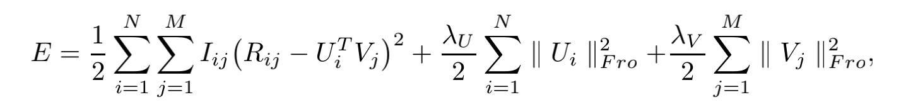
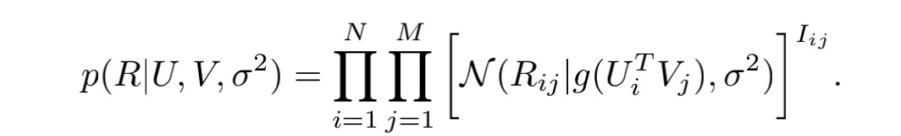

```{r}
library(dplyr)
library(Rcpp)
```

# Data Pre-processing
```{r}
Ratings <- read.csv("archive/Ratings.csv")
Ratings_by_users <- group_by(Ratings, User.ID)
user.Rating <- Ratings_by_users %>% summarise(
  num = length(Book.Rating),
  avg.rating = mean(Book.Rating)
)
num.Rating <- group_by(user.Rating, num) %>% summarise(
  users = length(avg.rating)
)
```

## ISBN
```{r}
N <- max(Ratings$User.ID)
book_idx <- unique(Ratings$ISBN)
M <- length(book_idx)
book_idx <- 1:M
names(book_idx) <- unique(Ratings$ISBN)
train <- read.csv("archive/train.csv")
train$ISBN <- book_idx[train$ISBN]
test <- read.csv("archive/test.csv")
test$ISBN <- book_idx[test$ISBN]
```

## Romve Some Entries
```{r}
train.book.avg <- group_by(train, ISBN) %>% summarise(
  avg.rating = mean(Book.Rating)
)
test <- test[which(test$ISBN %in% train.book.avg$ISBN),]
```

```{r echo=FALSE}
cat(paste("There are", N, "users and", M, "books.\n"))
cat(paste("There are", nrow(train), "examples in the training set and", nrow(test), "examples in the test set."))
```

```{r}
par(mfrow = c(1, 3))
boxplot(Ratings$Book.Rating, xlab = "full data")
boxplot(train$Book.Rating, xlab = "train")
boxplot(test$Book.Rating, xlab = "test")
```

## User Groups
```{r echo=FALSE}
grp <- list(0, 1:3, 4:6, 7:9,
            10:13, 14:17,
            18:19, 20:23, 24:50, 
            51:100, 100:1400)
grp_df <- lapply(grp, function(x){
  idx <- which(user.Rating$num %in% x)
  user <- user.Rating$User.ID[idx]
  user_idx <- which(test$User.ID %in% user)
  return(test[user_idx, ])
})
```

```{r echo=FALSE}
grp_num <- sapply(grp_df, function(x){
  nrow(x)
})
names(grp_num) <- c("0", "1-3", "4-6", "7-9", "10-13", "14-17", "18-19", "20-23", "24-50", "51-100", ">100")
```

```{r}
par(mfrow = c(1, 2))
barplot(grp_num/sum(grp_num))
barplot(grp_num[-11]/sum(grp_num[-11]))
```

# book average
```{r eval=FALSE}
train$Book.Rating <- train$Book.Rating/10
test$Book.Rating <- test$Book.Rating/10
train.book.avg <- group_by(train, ISBN) %>% summarise(
  avg.rating = mean(Book.Rating)
)
book_avg <- train.book.avg$avg.rating
names(book_avg) <- train.book.avg$ISBN
book_idx1 <- names(book_avg)
Rcpp::sourceCpp("cpp/pred_bookavg.cpp")
bookavg_rslt <- pred_bookavg(test, book_avg, book_idx1)
save(bookavg_rslt, file = "bookavg_rslt.Rda")
```
```{r echo=FALSE}
load("bookavg_rslt.Rda")
cat(paste("MAE:", round(bookavg_rslt$mae, 4), "\tRMSE: ", round(bookavg_rslt$rmse, 4)))
```

```{r}
head(cbind(test[, -1], bookavg_rslt$prediction), 10)
```

# PMF
```{r echo=FALSE}
knitr::include_graphics("figures/pmf1.jpg")



```

## Implementation
```{r echo=FALSE}

```
\newpage
```{r echo=FALSE}

```
```{r echo=FALSE}

```

## Simulation
```{r eval=FALSE}
set.seed(123)
A <- matrix(rnorm(1e4*4, sd = sqrt(1)), ncol = 1e4)
B <- matrix(rnorm(1e2*4, sd = sqrt(1)), ncol = 1e2)
E <- matrix(rnorm(1e4*1e2, sd = sqrt(1e-2)), ncol = 1e2)
aux <- t(A) %*% B
aux <- 1/(1+exp(-aux))
obs <- aux + E
obs <- ifelse(obs < 0, 0, obs)
obs <- ifelse(obs > 1, 1, obs)
obs <- floor(10*obs)/10
obs <- 10*obs
W <- matrix(sample(0:2, 1e4*1e2, prob = c(0.9, 0.07, 0.03), replace = TRUE), ncol = 1e2)
strain <- data.frame(User.ID = c(), ISBN = c(), Book.Rating = c())
stest <- data.frame(User.ID = c(), ISBN = c(), Book.Rating = c())
for(i in 1:1e4){
  for(j in 1:1e2){
    if(W[i, j] == 1){#train
      strain <- rbind(strain, c(i, j, obs[i, j]))
    }
    if(W[i, j] == 2){#test
      stest <- rbind(stest, c(i, j, obs[i, j]))
    }
  }
}
colnames(strain) <- c("User.ID", "ISBN", "Book.Rating")
colnames(stest) <- c("User.ID", "ISBN", "Book.Rating")
strain.book.avg <- group_by(strain, ISBN) %>% summarise(
  avg.rating = mean(Book.Rating)
)
stest <- stest[which(stest$ISBN %in% strain.book.avg$ISBN),]
write.csv(strain, file = "archive/strain.csv")
write.csv(stest, file = "archive/stest.csv")
```

```{r}
strain <- read.csv("archive/strain.csv")
stest <- read.csv("archive/stest.csv")
strain$Book.Rating <- strain$Book.Rating/10
stest$Book.Rating <- stest$Book.Rating/10
strain.book.avg <- group_by(strain, ISBN) %>% summarise(
  avg.rating = mean(Book.Rating)
)
sbook_avg <- strain.book.avg$avg.rating
names(sbook_avg) <- strain.book.avg$ISBN
sbook_idx1 <- names(sbook_avg)
Rcpp::sourceCpp("cpp/pred_bookavg.cpp")
sbookavg_rslt <- pred_bookavg(stest, sbook_avg, sbook_idx1)
```
```{r echo=FALSE}
cat(paste("MAE:", round(sbookavg_rslt$mae, 4), "\tRMSE: ", round(sbookavg_rslt$rmse, 4)))
```

```{r echo=FALSE, eval=FALSE}
sourceCpp("cpp/grad_pmf.cpp")
sourceCpp("cpp/loss_pmf.cpp")
sourceCpp("cpp/par_pmf.cpp")
sourceCpp("cpp/pred_pmf.cpp")
source("R/pmf_mm.R")
```
```{r echo=FALSE, eval=FALSE}
strain <- read.csv("archive/strain.csv")
stest <- read.csv("archive/stest.csv")
set.seed(123)
rst.sim.pmf <- pmf_mm(strain, stest, 4, c(1e-2, 1, 1), batch = 5e2, M = 1e2, N = 1e4, max_iter = 50, t = 1e-3)
save(rst.sim.pmf, file = "rst_sim_pmf.Rda")
```

```{r echo=FALSE}
load("rst_sim_pmf.Rda")
par(mfrow = c(1, 2))
plot((1:length(rst.sim.pmf$tr.mae)), rst.sim.pmf$tr.mae, col = "red", main = "MAE", xlab = "epoch", ylab = "MAE", type = "l")
points((1:length(rst.sim.pmf$tr.mae)), rst.sim.pmf$tr.mae, col = "blue", pch = 20)
plot((1:length(rst.sim.pmf$tr.rmse)), rst.sim.pmf$tr.rmse, col = "red", main = "RMSE", xlab = "epoch", ylab = "RMSE", type = "l")
points((1:length(rst.sim.pmf$tr.rmse)), rst.sim.pmf$tr.rmse, col = "blue", pch = 20)
```

## Real data set
```{r echo=FALSE}
load("pmf/result/mm-2.Rda")
par(mfrow = c(1, 3))
plot(1:length(result$tr.rmse), result$tr.rmse, col = "red", main = "PMF RMSE", xlab = "epoch", ylab = "RMSE", type = "l")
points(1:length(result$tr.rmse[1:10]), result$tr.rmse[1:10], col = "blue", pch  = 20)
abline(h = bookavg_rslt$rmse*10, lty = 2)
plot(1:length(result$tr.delta), log(result$tr.delta), col = "red", main = "PMF Relative Loss Change", xlab = "epoch", ylab = "log RLC", type = "l")
points(1:length(result$tr.delta[1:10]), log(result$tr.delta[1:10]), col = "blue", pch  = 20)
plot(1:length(result$tr.mae), result$tr.mae, col = "red", main = "PMF MAE", xlab = "epoch", ylab = "MAE", type = "l", ylim = c(2.6, 3.3))
points(1:length(result$tr.mae[1:10]), result$tr.mae[1:10], col = "blue", pch  = 20)
abline(h = bookavg_rslt$mae*10, lty = 2)
cat(paste("\nPMF", "\tMAE:", round(result$mae, 4), "\tRMSE:", round(result$rmse, 4)))
cat(paste("\nBook Average", "\tMAE:", round(bookavg_rslt$mae*10, 4), "\tRMSE:", round(bookavg_rslt$rmse*10, 4)))
```


# Logistic PMF
```{r echo=FALSE}


```

## Simulation

```{r echo=FALSE, eval=FALSE}
sourceCpp("cpp/grad_lpmf.cpp")
sourceCpp("cpp/loss_lpmf.cpp")
sourceCpp("cpp/par_lpmf.cpp")
sourceCpp("cpp/pred_lpmf.cpp")
source("R/lpmf_mm.R")
```
```{r echo=FALSE, eval=FALSE}
strain <- read.csv("archive/strain.csv")
stest <- read.csv("archive/stest.csv")
strain$Book.Rating <- strain$Book.Rating/10
stest$Book.Rating <- stest$Book.Rating/10
set.seed(123)
rst.sim.lpmf <- lpmf_mm(strain, stest, 3, c(1e-10, 1, 1), batch = 5e2, M = 1e2, N = 1e4, max_iter = 50, t = 0.3)
save(rst.sim.lpmf, file = "rst_sim_lpmf.Rda")
```

```{r echo=FALSE}
load("rst_sim_lpmf.Rda")
par(mfrow = c(1, 2))
plot((1:length(rst.sim.lpmf$tr.mae)), rst.sim.lpmf$tr.mae, col = "red", main = "MAE", xlab = "epoch", ylab = "MAE", type = "l")
points((1:length(rst.sim.lpmf$tr.mae[c(1:5)])), rst.sim.lpmf$tr.mae[c(1:5)], col = "blue", pch = 20)
plot((1:length(rst.sim.lpmf$tr.rmse)), rst.sim.lpmf$tr.rmse, col = "red", main = "RMSE", xlab = "epoch", ylab = "RMSE", type = "l")
points((1:length(rst.sim.lpmf$tr.rmse[c(1:5)])), rst.sim.lpmf$tr.rmse[c(1:5)], col = "blue", pch = 20)
```

## Real data set

### Momentum
```{r echo=FALSE}
load("lpmf/result/mm-2.Rda")
par(mfrow = c(1, 3))
plot(1:length(result$tr.rmse), result$tr.rmse, col = "red", main = "LPMF RMSE", xlab = "epoch", ylab = "RMSE", type = "l")
points(1:length(result$tr.rmse[1:10]), result$tr.rmse[1:10], col = "blue", pch  = 20)
abline(h = bookavg_rslt$rmse, lty = 2)
plot(1:length(result$tr.delta), log(result$tr.delta), col = "red", main = "LPMF Relative Loss Change", xlab = "epoch", ylab = "log RLC", type = "l")
points(1:length(result$tr.delta[1:10]), log(result$tr.delta[1:10]), col = "blue", pch  = 20)
plot(1:length(result$tr.mae), result$tr.mae, col = "red", main = "LPMF MAE", xlab = "epoch", ylab = "MAE", type = "l", ylim = c(0.28, 0.43))
points(1:length(result$tr.mae[1:10]), result$tr.mae[1:10], col = "blue", pch  = 20)
abline(h = bookavg_rslt$mae, lty = 2)
cat(paste("\nLPMF Momentum", "\tMAE:", round(result$mae, 4), "\tRMSE:", round(result$rmse, 4)))
cat(paste("\nBook Average", "\tMAE:", round(bookavg_rslt$mae, 4), "\tRMSE:", round(bookavg_rslt$rmse, 4)))
```

### SGD
```{r echo=FALSE}
load("lpmf/result/gd-2.Rda")
par(mfrow = c(1, 3))
plot(1:length(result$tr.rmse), result$tr.rmse, col = "red", main = "LPMF RMSE", xlab = "epoch", ylab = "RMSE", type = "l")
points(1:length(result$tr.rmse), result$tr.rmse, col = "blue", pch  = 20)
abline(h = bookavg_rslt$rmse, lty = 2)
plot(1:length(result$tr.delta), log(result$tr.delta), col = "red", main = "LPMF Relative Loss Change", xlab = "epoch", ylab = "log RLC", type = "l")
points(1:length(result$tr.delta), log(result$tr.delta), col = "blue", pch  = 20)
plot(1:length(result$tr.mae), result$tr.mae, col = "red", main = "LPMF MAE", xlab = "epoch", ylab = "MAE", type = "l")
points(1:length(result$tr.mae), result$tr.mae, col = "blue", pch  = 20)
abline(h = bookavg_rslt$mae, lty = 2)
cat(paste("\nLPMF SGD", "\tMAE:", round(result$mae, 4), "\tRMSE:", round(result$rmse, 4)))
cat(paste("\nBook Average", "\tMAE:", round(bookavg_rslt$mae, 4), "\tRMSE:", round(bookavg_rslt$rmse, 4)))
```

### Dimension of the Feature Vectors
```{r echo=FALSE}
dir1 <- "lpmf/result/mm-"
dir2 <- "lpmf/result/gd-"
dir3 <- ".Rda"
mm.mae <- NULL
mm.rmse <- NULL
gd.mae <- NULL
gd.rmse <- NULL
for(i in 1:4){
  dim <- 2^i
  load(paste0(dir1, dim, dir3))
  mm.mae[i] <- result$mae
  mm.rmse[i] <- result$rmse
  load(paste0(dir2, dim, dir3))
  gd.mae[i] <- result$mae
  gd.rmse[i] <- result$rmse
}
```

```{r echo=FALSE}
par(mfrow = c(1, 2))
plot(2^(1:4), mm.mae, type = "l", col = "red", xlab = "dimension", ylab = "MAE", ylim = c(0.25, 0.3), main = "LPMF: MAE-Dimension", xaxt = "none")
points(2^(1:4), mm.mae, pch=20, col = "red")
lines(2^(1:4), gd.mae, col = "blue", xlab = "dimension", ylab = "MAE")
points(2^(1:4), gd.mae, pch=20, col = "blue")
legend("topright", legend = c("momentum", "sgd"), col = c("red", "blue"), pch = 20, lty = 1)
axis(1, at = 2^(1:4), labels = c(2, 4, 8, 16))
plot(2^(1:4), mm.rmse, type = "l", col = "red", xlab = "dimension", ylab = "MAE", ylim = c(0.35, 0.4), main = "LPMF: RMSE-Dimension", xaxt = "none")
points(2^(1:4), mm.rmse, pch=20, col = "red")
lines(2^(1:4), gd.rmse, col = "blue", xlab = "dimension", ylab = "RMSE")
points(2^(1:4), gd.rmse, pch=20, col = "blue")
legend("topright", legend = c("momentum", "sgd"), col = c("red", "blue"), pch = 20, lty = 1)
axis(1, at = 2^(1:4), labels = c(2, 4, 8, 16))
```

# Constrained PMF
```{r echo=FALSE}


```

## Simulation
```{r echo=FALSE, eval=FALSE} 
sourceCpp("cpp/user_cpmf.cpp")
sourceCpp("cpp/grad_cpmf.cpp")
sourceCpp("cpp/loss_cpmf.cpp")
sourceCpp("cpp/pred_cpmf.cpp")
source("R/cpmf_mm.R")
```

```{r echo=FALSE, eval=FALSE}
strain <- read.csv("archive/sctrain.csv")
stest <- read.csv("archive/stest.csv")
strain$Book.Rating <- strain$Book.Rating/10
stest$Book.Rating <- stest$Book.Rating/10
user_idx <- unique(strain$User.ID)
user_book <- lapply(user_idx, function(id){
  df <- strain[which(strain$User.ID == id), ]
  return(df$ISBN)
})
sread <- list(user_idx = user_idx, user_book = user_book, user_num = sapply(user_book, function(x){
  length(x)
}))
```
```{r echo=FALSE, eval=FALSE}
set.seed(123)
rst.sim.cpmf <- cpmf_mm(strain, stest, sread, 3, c(1e-2, 1, 1, 1), batch = 5e2, M = 1e2, N = 1e4, max_iter = 10, t = 0.3)
save(rst.sim.cpmf, file = "rst_sim_cpmf.Rda")
```
```{r echo=FALSE}
load("rst_sim_cpmf.Rda")
par(mfrow = c(1, 2))
plot((1:length(rst.sim.cpmf$tr.mae)), rst.sim.cpmf$tr.mae, col = "red", main = "MAE", xlab = "epoch", ylab = "MAE", type = "l")
points((1:length(rst.sim.cpmf$tr.mae[c(1:5)])), rst.sim.cpmf$tr.mae[c(1:5)], col = "blue", pch = 20)
plot((1:length(rst.sim.cpmf$tr.rmse)), rst.sim.cpmf$tr.rmse, col = "red", main = "RMSE", xlab = "epoch", ylab = "RMSE", type = "l")
points((1:length(rst.sim.cpmf$tr.rmse[c(1:5)])), rst.sim.cpmf$tr.rmse[c(1:5)], col = "blue", pch = 20)
```

## Real Data
```{r echo=FALSE}
load("cpmf/result/mm-4.Rda")
par(mfrow = c(1, 3))
plot(1:length(result$tr.rmse), result$tr.rmse, col = "red", main = "CPMF RMSE", xlab = "epoch", ylab = "RMSE", type = "l")
points(1:length(result$tr.rmse[1:10]), result$tr.rmse[1:10], col = "blue", pch  = 20)
abline(h = bookavg_rslt$rmse, lty = 2)
plot(1:length(result$tr.delta), log(result$tr.delta), col = "red", main = "CPMF Relative Loss Change", xlab = "epoch", ylab = "log RLC", type = "l")
points(1:length(result$tr.delta[1:10]), log(result$tr.delta[1:10]), col = "blue", pch  = 20)
plot(1:length(result$tr.mae), result$tr.mae, col = "red", main = "LPMF MAE", xlab = "epoch", ylab = "MAE", type = "l", ylim = c(0.28, 0.43))
points(1:length(result$tr.mae[1:10]), result$tr.mae[1:10], col = "blue", pch  = 20)
abline(h = bookavg_rslt$mae, lty = 2)
cat(paste("CPMF","\tMAE:", round(result$mae, 4), "\tRMSE:", round(result$rmse, 4)))
load("lpmf/result/mm-4.Rda")
cat(paste("\nLPMF","\tMAE:", round(result$mae, 4), "\tRMSE:", round(result$rmse, 4)))
cat(paste("\nBook Average","\tMAE:", round(bookavg_rslt$mae, 4), "\tRMSE:", round(bookavg_rslt$rmse, 4)))
```

```{r echo=FALSE}
load("cpmf/result/mm-4.Rda")
result.cpmf <- result
load("lpmf/result/mm-4.Rda")
result.lpmf <- result
load("read.Rda")
sourceCpp("cpp/user_cpmf.cpp")
sourceCpp("cpp/pred_cpmf.cpp")
sourceCpp("cpp/pred_lpmf.cpp")

load("grp_df.Rda")
grp_df[[1]] <- NULL
grp_df[[1]] <- NULL
grp_rst <- lapply(grp_df, function(df){
  df$Book.Rating <- df$Book.Rating/10
  lpmf <-  pred_lpmf(df, t(result.lpmf$U), t(result.lpmf$V))
  cpmf <- pred_cpmf(df,t(result.cpmf$U), t(result.cpmf$V))
  return(list(lpmf = lpmf, cpmf = cpmf))
})
mae.lpmf <- NULL
mae.cpmf <- NULL
rmse.lpmf <- NULL
rmse.cpmf <- NULL
for(i in 1:9){
  aaa <- grp_rst[[i]]
  lpmf.aaa <- aaa$lpmf
  cpmf.aaa <- aaa$cpmf
  mae.lpmf[i] <- lpmf.aaa$mae
  mae.cpmf[i] <- cpmf.aaa$mae
  rmse.lpmf[i] <- lpmf.aaa$rmse
  rmse.cpmf[i] <- cpmf.aaa$rmse
}
```

```{r echo=FALSE}
par(mfrow = c(1, 3))
plot(1:9, mae.lpmf, col = "blue", type = "l", xlab = "user group", ylab = "MAE", main = "MAE: CPMF vs LPMF", xaxt = "none")
axis(1, at = 1:9, labels = names(grp_num[3:11]))
points(1:9, mae.lpmf, col = "blue", pch = 20)
lines(1:9, mae.cpmf, col = "red", type = "l", xlab = "user group", ylab = "MAE", main = "MAE: CPMF vs LPMF")
points(1:9, mae.cpmf, col = "red", pch = 20)
legend("bottomleft", legend = c("LPMF", "CPMF"), lty = 1, col = c("blue", "red"), pch = 20)
barplot(grp_num[3:11]/sum(grp_num[3:11]))
plot(1:9, rmse.lpmf, col = "blue", type = "l", xlab = "user group", ylab = "RMSE", main = "RMSE: CPMF vs LPMF", xaxt = "none")
axis(1, at = 1:9, labels = names(grp_num[3:11]))
points(1:9, rmse.lpmf, col = "blue", pch = 20)
lines(1:9, rmse.cpmf, col = "red", type = "l", xlab = "user group", ylab = "MAE", main = "MAE: CPMF vs LPMF")
points(1:9, rmse.cpmf, col = "red", pch = 20)
legend("bottomleft", legend = c("LPMF", "CPMF"), lty = 1, col = c("blue", "red"), pch = 20)
```
