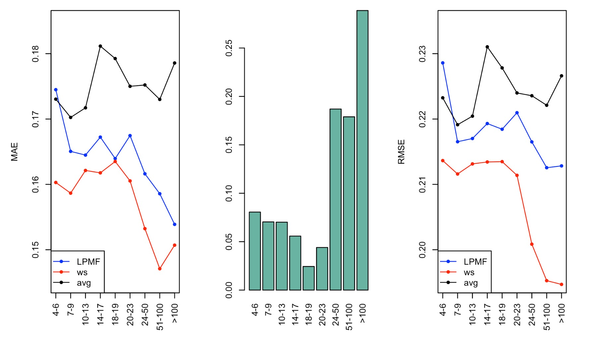

```{r}
library(dplyr)
library(Rcpp)
```

# Data Pre-processing
```{r}
Ratings <- read.csv("archive/Ratings.csv")
Ratings <- Ratings[Ratings$Book.Rating != 0, ]
Ratings_by_users <- group_by(Ratings, User.ID)
user.Rating <- Ratings_by_users %>% summarise(
  num = length(Book.Rating),
  avg.rating = mean(Book.Rating)
)
num.Rating <- group_by(user.Rating, num) %>% summarise(
  users = length(avg.rating)
)
```
 
## ISBN
```{r}
N <- max(Ratings$User.ID)
book_idx <- unique(Ratings$ISBN)
M <- length(book_idx)
book_idx <- 1:M
names(book_idx) <- unique(Ratings$ISBN)
train <- read.csv("archive/train0.csv")
train$ISBN <- book_idx[train$ISBN]
test <- read.csv("archive/test0.csv")
test$ISBN <- book_idx[test$ISBN]
```

## Romve Some Entries
```{r}
train.book.avg <- group_by(train, ISBN) %>% summarise(
  avg.rating = mean(Book.Rating)
)
test <- test[which(test$ISBN %in% train.book.avg$ISBN),]
```

```{r echo=FALSE}
cat(paste("There are", N, "users and", M, "books.\n"))
cat(paste("There are", nrow(train), "examples in the training set and", nrow(test), "examples in the test set."))
```

## User Groups
```{r echo=FALSE}
load("grp_df.Rda")
grp_num <- sapply(grp_df, function(x){
  nrow(x)
})
names(grp_num) <- c("0", "1-3", "4-6", "7-9", "10-13", "14-17", "18-19", "20-23", "24-50", "51-100", ">100")
```

```{r}
par(mfrow = c(1, 2))
barplot(grp_num/sum(grp_num))
barplot(grp_num[-11]/sum(grp_num[-11]))
```

# warm-start LPMF
```{r echo=FALSE}


```

# Users' Information
```{r}
Users <- read.csv("archive/Users.csv")
Users <- Users[1:N, ]
summary(Users)
sum(is.na(Users$Age))/length(Users$Age)
length(unique(Users$Location))
```

## pre-processing
```{r}
Users[is.na(Users$Age), "Age"] <- 0
Users[which(Users$Age > 100), "Age"] <- 0
Users[which(Users$Age < 7), "Age"] <- 0
```

## Check intuition
```{r}
user.Rating <- merge(user.Rating, Users)
Rating_by_age <- group_by(user.Rating, Age) %>% summarise(
  user.num = length(num),
  avg.rating = sum(num*avg.rating)/sum(num)
)
head(Rating_by_age, 10)
```

## Group by Age
```{r eval=FALSE}
FU <- matrix(0, nrow = N, ncol = 2) 
FU[, 1] <- 1
FU[, 2] <- Users$Age
FU[which(Users$Age %in% 81:90), 2] <- 81
FU[which(Users$Age %in% 91:100), 2] <- 82
FU[which(Users$Age == 0), 2] <- 6
FU[, 2] <- FU[, 2] - 6
FU <- t(FU)
save(FU, file = "FU.Rda")
```

# Books' Information
```{r}
Books <- read.csv("archive/Books.csv")
Books <- Books[Books$ISBN %in% names(book_idx), ]
Books$Year.Of.Publication <- as.integer(Books$Year.Of.Publication)
Books$Year.Of.Publication[which(Books$Year.Of.Publication > 2004)] <- 0
Books$Year.Of.Publication[is.na(Books$Year.Of.Publication)] <- 0
summary(Books) 
length(unique(Books$Book.Title))
length(unique(Books$Book.Author))
length(unique(Books$Publisher))
length(unique(Books$Year.Of.Publication))
```

## check intuition
```{r}
book_rating <- group_by(Ratings, ISBN)%>% summarise(
  num = length(Book.Rating),
  avg.rating = mean(Book.Rating)
)
book_rating <- merge(book_rating, Books)
Rating_by_year <- group_by(book_rating, Year.Of.Publication) %>% summarise(
  user.num = length(num),
  avg.rating = sum(num*avg.rating)/sum(num)
)
Rating_by_year[50:60, ]
```

## Group by Year 
```{r eval=FALSE}
FV <- matrix(0, ncol = 2, nrow = M)
FV[, 1] <- 1
FV[book_idx[Books$ISBN], 2] <-  Books$Year.Of.Publication
FV[which(FV[, 2] < 1920 & FV[, 2] != 0), 2] <- 1
FV[which(FV[, 2] %in% 1920:1929), 2] <- 2
FV[which(FV[, 2] %in% 1930:1939), 2] <- 3
FV[which(FV[, 2] %in% 1940:1949), 2] <- 4
FV[which(FV[, 2] > 1949), 2] <- FV[which(FV[, 2] > 1949), 2] - 1945
FV <- t(FV)
save(FV, file = "FV.Rda")
```

# Results
```{r}

```


```{r echo=FALSE,eval=FALSE}
load("result/lpmf/gd-2.Rda")
idx <- c(4, 7, 8, 9, 24, 25, 118, 146)
bn <- names(book_idx)[idx]
aaa <- Books[which(Books$ISBN %in% bn), ]
idx <- book_idx[aaa$ISBN]
aaa$ISBN <- idx
plot(result$V[1, idx], result$V[2, idx], pch = 20, ylim = c(-1, 1.5), xlim = c(-1.5, 1.5), xlab = "trait1", ylab = "trait2")
abline(h=0, lty=2)
abline(v=0, lty=2)
text(result$V[1, idx]-0.2, result$V[2, idx], labels = aaa$Book.Title, cex = 0.5)
```
